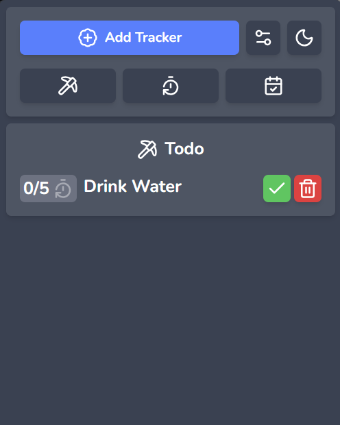

# Minimal Tray Tasker

Track your everyday tasks right from your system tray




## Install

Head to the releases page and download the right package for your system.

## Developing

Install Node dependencies
```
npm i
```

Run the project
```
npm run tauri dev
```

Build the project
```
npm run tauri build
```
